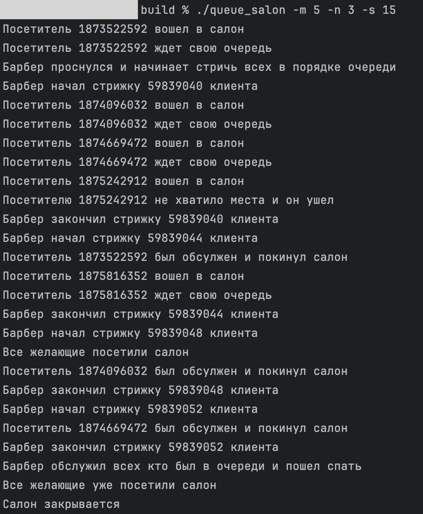

# ИДЗ 4
## Вариант 1
### Постановка задачи
В маленьком городке есть салон парикхмахерской, в котором работает один сонный барбер.
Программа имитирует работу салона в течении одного дня.\
Пусть нам известно число __M__ – максимальное количество посетителей в день. 
В салоне есть ровно __N__ мест для ожидания.
Салон будет работать, пока его не посетят __M__ человек, иначе будет не маржинально :).\
Каждый посетитель заходит в салон и занимает место, если есть свободное (то есть размер очереди меньше __N__), в ожидании барбера.
Барбер просыпается, как только хотя бы один человек занял очередь, и не засыпает, пока очередь не опустеет, а потом идет обратно спать. 
При этом салон закрывается при выполнении двух условий – его посетили все __M__ человек (не обязательно всех постригли), и барбер успел уснуть.
То есть даже если все люди побывали в салоне, барбер, если он не спит, пострижет всех в очереди, а потом закроет заведение.


### Входные данные
Числа M и N считываются с консоли. 
Командная строка поддерживает следующие флаги:
- `-m` задать число __M__ с командной строки. После флага должно следовать целое положительное число.
- `-n` задать число __N__ с командной строки. После флага должно следовать целое положительное число.
- `-s` задать seed для генерации чисел
- `-i` задать путь к входному файлу, если передан, все предыдущие флаги игнорируются
- `-o` задать путь к выходному файлу, в него будет записан лог работы салона
- `-c` нужен ли вывод в консоль (1 (по умолчанию) – данные будут выводиться в консоль, 0 – вывода в консоль не будет)

В случае если данные читаются из файла, задаются также идентефикаторы посетителей.
Иначе они генерируются случайным образом.
При несоблюдении формата флагов или неправильном количестве аргументов командной строки, программа завершается.
Также программа завершается, если не удалось открыть входной или выходной файл. \
Корректность остальных входных данных не проверяется во благо упрощения считывания данных

### Выходные данные 
Программа генерирует логи работы салона в течение дня и записывает их файл и/или ввыводит на консоль
в соотвествии с указанными флагами.


### Алгоритм решения
Реализовано решение этой задачи, использующее один мьютекс
на изменение "состояния салона" и очередь ждущих посетителей.
И посетители, и барбер представляют собой отдельные потоки (как и основной поток, который порождает посетителей).

Барбер ждет (спит) пока не появится хотя бы один посетитель, захватывая лок раз в какое-то время и проверяя условие. 
После этого он не засыпает, пока очередь не опустеет, захватывает лок, забирает одного посетителя, отпускает лок на время стрижки, 
потом возвращает его, чтобы сообщить об окончании стрижки и заново проверяет, пустая ли очередь. Как только она пустеет, он сообщает о том что идет спать и отпускает лок.
Поток барбера завершает работу в тот момент, когда все посетители уже побывали в салоне, и барбер обслужит всех кто был в очереди на этот момент.

Каждый посетитель (то есть его поток) ждет момента когда можно войти в салон (лок свободен), захватывает лок и проверяет,
есть ли свободное место в очереди.
Если есть, он дописывает себя в очередь и ждет, когда его заберет барбер и обслужит, то есть когда номер в очереди будет меньше количества уже обслуженных.
Тогда он опять забирает себе лок, уведомляет о своем уходе и завершает работу.

Основной поток генерирует __M__ потоки пользователей с частотой раз в секунду, и сообщает барберу, когда все посетители были сгенерированы.

### Пример работы программы
Вызов из консоли с заданными __M__ __N__ и сидом генерации:\


### Сборка 
```angular2html
$ mkdir build
$ cd build
$ cmake ..
$ make
$ ./main
```